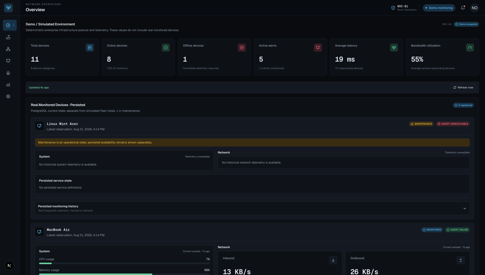
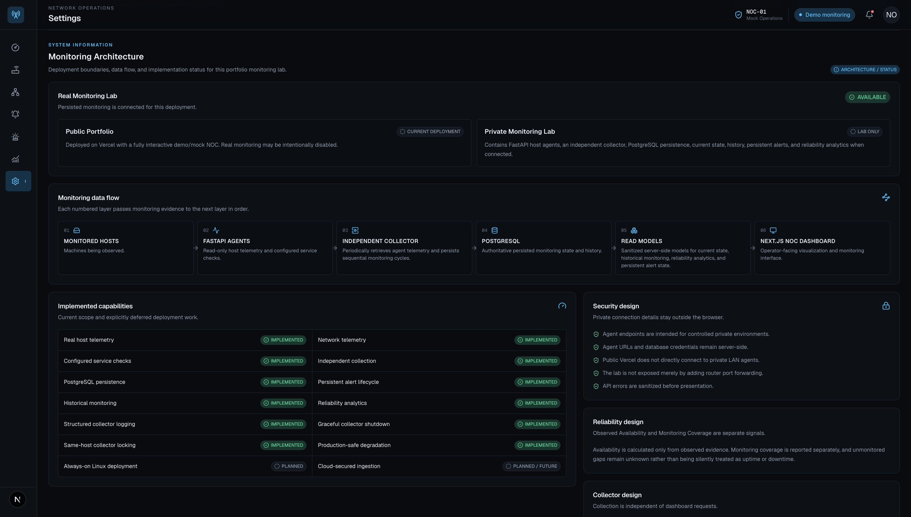
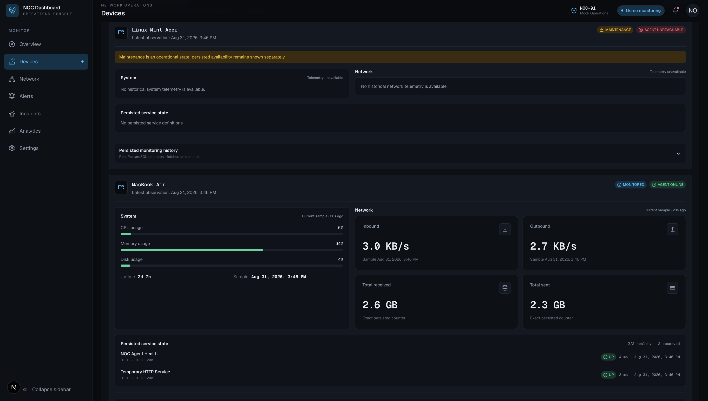
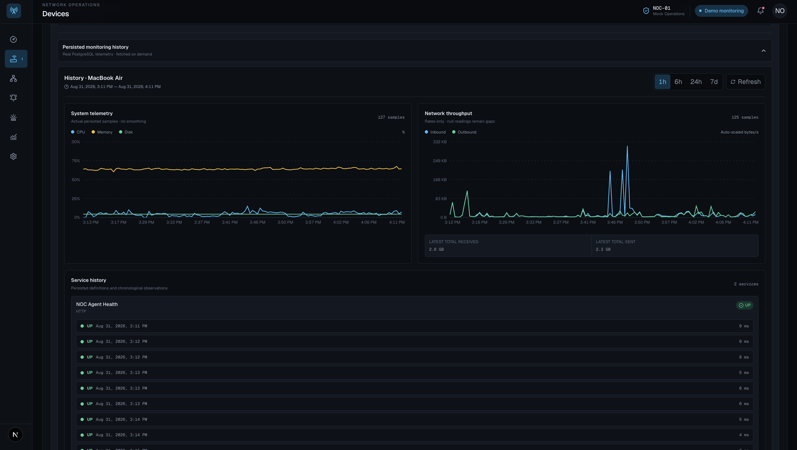
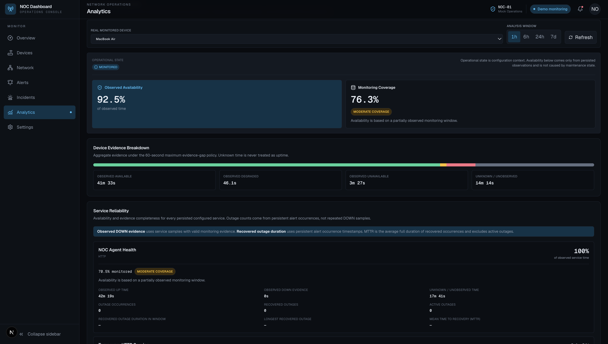
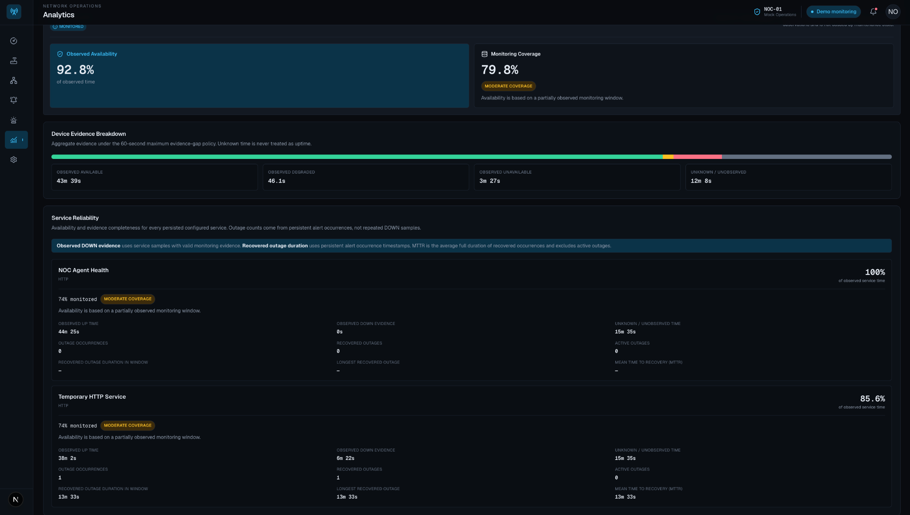

# NOC Monitoring Platform

A full-stack infrastructure monitoring project with two deliberately separated contexts: a public enterprise-inspired NOC demonstration and a private lab that collects real host, network, and service telemetry, persists evidence in PostgreSQL, tracks alert lifecycles, and calculates coverage-aware reliability.

[Live Demo](https://noc-dashboard-theta.vercel.app/) · [Monitoring Agent](https://github.com/Gio6076/noc-monitor-agent) · [Repository](https://github.com/Gio6076/noc-dashboard) · [Persistence Documentation](docs/postgresql-persistence.md)



The public interface remains useful without access to the private monitoring backend. Deterministic demo devices let recruiters explore the NOC workflow, while real monitored devices—and their totals, observations, alerts, and analytics—remain a separate private-lab data path.

## Overview

This project began as a hands-on NOC interface and grew into a monitoring lab rather than remaining a frontend-only dashboard. FastAPI agents expose read-only observations from registered hosts; an independent collector retrieves that evidence; PostgreSQL stores current and historical state; and the Next.js application presents current monitoring, history, persistent alerts, and reliability analytics.

The public Vercel deployment intentionally uses simulated infrastructure data and disables persisted private monitoring. The agent, collection, persistence, history, alert lifecycle, and analytics paths have been implemented and tested locally. Always-on Linux deployment and secured cloud ingestion remain planned work—not production claims.

## Key capabilities

| Area | Implemented capability |
| --- | --- |
| Telemetry | Host CPU, memory, disk, uptime, network throughput/counters, and configured HTTP/TCP service observations |
| Collection | Sequential independent collector with configurable cadence, structured JSON logs, graceful signal handling, and same-host process locking |
| Persistence | PostgreSQL observations, telemetry samples, services, collection runs, and alert lifecycle state through Drizzle ORM |
| Read models | Sanitized current-state, historical, reliability, and persistent-alert views |
| History | Fixed 1h, 6h, 24h, and 7d views over persisted samples, with missing evidence preserved as gaps |
| Reliability | Time-weighted observed availability, monitoring coverage, unknown time, outage occurrences, recovered duration, and MTTR |
| Deployment safety | Explicit public-demo/private-lab boundary and safe disabled/unavailable states |

The collector lock prevents ordinary duplicate starts only on the same host. It is not a distributed lock or lease.

## Architecture



**Monitored Hosts → FastAPI Agents → Independent Collector → PostgreSQL → Read Models → Next.js NOC Dashboard**

| Layer | Responsibility |
| --- | --- |
| Monitored hosts | Machines and configured services being observed |
| FastAPI agents | Collect read-only host, system, network, and service-check telemetry |
| Independent collector | Queries registered agents sequentially and persists cycles independently of dashboard requests |
| PostgreSQL | Authoritative persisted state, samples, collection runs, services, and alert lifecycle history |
| Read models | Produce sanitized current-state, history, reliability, and alert representations |
| Next.js dashboard | Presents demo and persisted monitoring views without exposing private connection details |

Dashboard requests never initiate a collection cycle. The UI reads PostgreSQL-backed models, so collection and presentation cadences remain independent.

## Public demo and private monitoring lab

| | Public demo | Private monitoring lab |
| --- | --- | --- |
| Runtime | Next.js dashboard on Vercel | Local/private agents, collector, dashboard, and PostgreSQL |
| Data | Deterministic simulated enterprise infrastructure | Real host, network, and configured HTTP/TCP service observations |
| Access | Public portfolio experience | Controlled private lab environment |
| Persisted monitoring | Intentionally disabled | Enabled through server-only configuration |
| Purpose | Safe exploration without private infrastructure | Persistence, history, alert lifecycle, and reliability validation |

The public Vercel deployment does **not** connect directly to private LAN agents or the local PostgreSQL database. Demo devices are not real monitored devices and are not included in real monitoring totals.

## Real device monitoring



This local-lab capture shows the MacBook Air agent online with persisted system, network, and service observations. The Linux Mint Acer is registered in maintenance and its latest persisted availability is unreachable; it is not currently collecting active telemetry in this capture.

Maintenance is an operator-defined operational state, not an availability result. The dashboard keeps operational state and observed availability separate rather than translating maintenance into uptime or downtime.

## Historical monitoring



Historical views query actual PostgreSQL samples for the selected device and window. System telemetry, network throughput, exact byte counters, configured services, and chronological service observations retain their original timestamps. The read model does not interpolate, smooth, downsample, or fabricate intermediate readings; missing readings remain gaps.

The interface supports fixed 1-hour, 6-hour, 24-hour, and 7-day windows. The API accepts bounded windows from 1 to 168 hours.

## Reliability analytics



**Observed Availability ≠ Monitoring Coverage**

- **Observed Availability** measures available time only within periods supported by valid monitoring evidence. It is a monitoring metric, not an SLA claim.
- **Monitoring Coverage** measures how much of the selected window has valid evidence.
- **Unknown time** is excluded from the availability denominator and remains unknown; it is never automatically counted as uptime.

An observation carries its state forward only until the next observation or for a maximum of 60 seconds, whichever comes first. This bounded evidence-gap policy prevents stale samples from filling long collection gaps. Device `partial` evidence is available-but-degraded; `unreachable` is unavailable; and `not-fetched` contributes no evidence.

## Service outage and recovery



This screenshot comes from a real local test of the configured **Temporary HTTP Service**, an intentionally temporary testing target rather than a production service.

Service samples supply time-weighted observed UP/DOWN evidence and coverage. PostgreSQL alert rows independently represent continuous outage occurrences: repeated DOWN observations update one active occurrence, positive recovery evidence closes it, and a later failure creates a new occurrence. Recovered outage duration and MTTR use persisted occurrence and recovery timestamps; active outages are excluded from MTTR. These values differ from the amount of observed DOWN sample evidence inside a selected window.

## Monitoring flow

1. A FastAPI agent collects host, system, network, and configured service telemetry.
2. The independent collector queries each registered monitoring agent.
3. A cycle persists observations, telemetry, service state, and alert lifecycle changes transactionally in PostgreSQL.
4. Current-state and historical read models query PostgreSQL without invoking agents.
5. Alert conditions are reconciled into persistent occurrence, update, and recovery state using explicit recovery evidence.
6. Reliability analytics calculate evidence-aware availability, coverage, unknown time, and service recovery metrics.
7. The dashboard presents demo data separately from real current, historical, alert, and reliability views.

## Technology stack

| Area | Technologies |
| --- | --- |
| Frontend | Next.js App Router, React, TypeScript, Tailwind CSS, Recharts, Lucide React |
| Monitoring agent | Python, FastAPI, psutil ([separate repository](https://github.com/Gio6076/noc-monitor-agent)) |
| Persistence | PostgreSQL, Drizzle ORM, `pg` |
| Collection/runtime | Node.js, TypeScript, JSON logging, signal-aware shutdown, local process lock |
| Testing/tooling | Node.js test runner, TypeScript, ESLint, Next.js production build |

## Security and deployment design

- Agent endpoints are intended for controlled private environments.
- Agent URLs and database credentials remain server-side and are omitted from sanitized read models and API responses.
- Public Vercel does not access private LAN agents or the local database.
- Router port forwarding is neither required nor recommended for the public portfolio.
- Disabled or unavailable persistence returns sanitized capability errors; it does not invent empty state, unreachable devices, outages, or zero-percent reliability.
- A failed client refresh preserves the last successful persisted state while reporting degraded freshness.

Authentication, public encrypted ingestion, and cloud exposure of real monitoring are not implemented. Monitoring beyond the private lab requires a future secured ingestion and datastore design.

## Local development and lab setup

### Prerequisites

- A current Node.js release compatible with the installed Next.js version
- npm
- PostgreSQL for persisted private-lab monitoring
- The separately maintained [monitoring agent](https://github.com/Gio6076/noc-monitor-agent) on each monitored host

Install dependencies and start the dashboard:

```bash
npm install
npm run dev
```

Use [`.env.example`](.env.example) as the authoritative variable list, but replace its development values with private configuration. Do not commit `.env.local`.

```dotenv
NOC_PERSISTED_MONITORING_ENABLED=true
DATABASE_URL=postgresql://<user>:<password>@<database-host>:<port>/<database-name>
NOC_MAC_AGENT_API_URL=http://<private-agent-host>:<port>
NOC_LINUX_AGENT_API_URL=http://<private-agent-host>:<port>
```

Only the exact value `true` enables persisted monitoring. For a public/demo-only deployment, set `NOC_PERSISTED_MONITORING_ENABLED=false` and omit private agent and database connectivity.

Apply the existing migration, run one trusted-registry cycle, or start the independent collector:

```bash
npm run db:migrate
npm run monitoring:collect
npm run monitoring:collector
```

The collector runs immediately and waits 20 seconds after each cycle by default. `NOC_COLLECTION_INTERVAL_SECONDS` may set a finite interval of at least 5 seconds. Ctrl+C performs a graceful shutdown. See [docs/postgresql-persistence.md](docs/postgresql-persistence.md) for database and schema details.

The Temporary HTTP Service shown above is optional testing-only agent configuration; it is not required by the dashboard or collector.

## Testing

```bash
npm test
npm run lint
npx tsc --noEmit
npm run build
```

Tests cover capability degradation, operational state, agent responses, persistence identity and mapping, current and historical read models, alert evaluation and recovery, reliability calculations and presentation, collector cadence/runtime/logging/shutdown/locking, persisted UI behavior, and architecture/status presentation.

## Current status and roadmap

### Implemented and locally tested

- Real agent-based host, network, and HTTP/TCP service monitoring
- Independent sequential collection and PostgreSQL persistence
- Current-state, historical, persistent-alert, and reliability read paths
- Persistent alert occurrence and recovery tracking
- Coverage-aware availability and service recovery analytics
- Structured logging, graceful collector shutdown, and same-host duplicate-start protection
- Public-demo/private-lab separation and safe degradation

### Planned

- Always-on deployment using the Acer/Linux monitoring host
- Service supervision with systemd after physical Linux deployment
- Secured cloud ingestion and a protected reachable datastore if real monitoring is exposed beyond the private lab

The current project does not claim 24/7 production monitoring.

## Project structure

```text
app/                 Next.js pages and sanitized monitoring API routes
components/          NOC interface and real-monitoring presentation
data/                Deterministic demo fleet and private registry configuration
lib/                 Collection, analytics, capability, persistence, and read-model logic
lib/server/          Server-only database, repositories, and monitoring orchestration
scripts/             One-shot and long-running collector entry points
drizzle/             PostgreSQL migration
tests/               Automated Node.js tests
docs/                Persistence design notes and portfolio screenshots
```

## Author

Giovani Paulo R. Ebarola — BS Information Technology student
